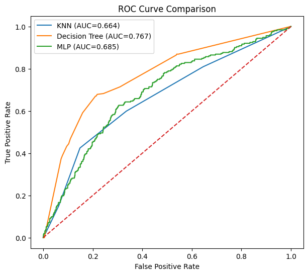
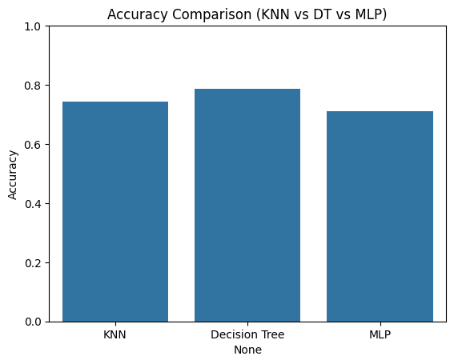
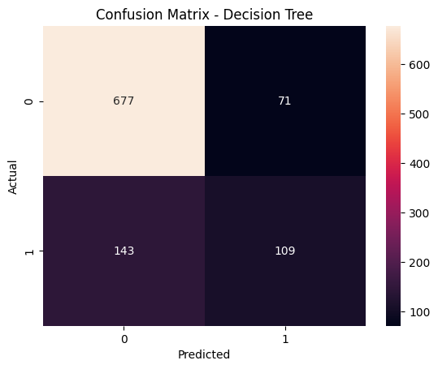

# Career Switch Prediction Using Machine Learning

## Overview
This project applies machine learning techniques to predict whether a professional is likely to switch careers based on demographic, educational, and work-related attributes. The goal is to compare multiple models and evaluate their performance on an imbalanced, real-world dataset.

The project was completed as part of a university machine learning course and focuses on the end-to-end ML workflow, from preprocessing to model comparison.

---

## 🧠 Problem Statement
Career switching has become increasingly common due to rapid changes in technology and job requirements. Using structured data, this project frames career switching as a binary classification problem and evaluates how different models handle non-linear relationships and class imbalance.

---

## 📊 Dataset
- **Samples:** 5,000  
- **Features:**  
  - 14 raw features  
  - 168 features after one-hot encoding  
- **Target:** `will_change_career` (0 = No, 1 = Yes)  
- **Class imbalance:**  
  - No switch: 3,738  
  - Switch: 1,262  

The dataset includes demographic information, education level, company attributes, training hours, and experience-related variables.

---

## 🔍 Exploratory Data Analysis
Key insights from EDA:
- No single feature strongly predicts career switching, suggesting a non-linear problem
- Higher training hours are associated with a greater likelihood of switching careers
- City development index and company-related attributes influence switching behavior
- Class imbalance makes accuracy alone an insufficient evaluation metric

---

## 🛠️ Data Preprocessing
- Missing values handled using:
  - Mean imputation for numerical features
  - Mode imputation for categorical features
- One-hot encoding applied to categorical variables
- Feature scaling using `StandardScaler` (after train-test split to prevent data leakage)
- Identifier column removed
- Stratified train-test split (80/20) to preserve class distribution

---

## 🤖 Models Trained

### Supervised Learning
- K-Nearest Neighbors (baseline)
- Decision Tree
- Multi-Layer Perceptron (MLP Neural Network)

### Unsupervised Learning
- K-Means clustering (used to explore hidden patterns and structure)

---

## 📈 Evaluation Metrics
Due to class imbalance, models were evaluated using:
- Accuracy
- Precision
- Recall
- F1-score
- ROC-AUC

---

## 🏆 Results Summary

### Model Performance Comparison

| Model | Accuracy | Precision | Recall | F1-score | AUC |
|------|----------|-----------|--------|----------|-----|
| KNN | 0.744 | 0.491 | 0.425 | 0.455 | 0.664 |
| Decision Tree | **0.786** | **0.606** | 0.433 | **0.505** | **0.767** |
| MLP (Neural Network) | 0.710 | 0.429 | **0.456** | 0.442 | 0.685 |

---

### ROC Curve Comparison

  

The ROC curve comparison highlights that the Decision Tree model achieves the highest AUC, indicating stronger overall class separation performance compared to KNN and MLP.

---

### Model Accuracy Comparison

  

This plot shows that the Decision Tree outperforms the other models in terms of accuracy while maintaining balanced performance on an imbalanced dataset.

---

### Confusion Matrix (Decision Tree)

  

The confusion matrix for the Decision Tree model demonstrates a balanced trade-off between precision and recall, supporting its selection as the best-performing model.

---

## ⚠️ Challenges & Limitations
- Class imbalance
- High dimensionality after encoding
- Sensitivity of some models to feature scaling
- Limited interpretability for neural networks

---

## 📄 Documentation
A detailed project report with full methodology, analysis, and additional visualizations is available in the `docs/` folder.
